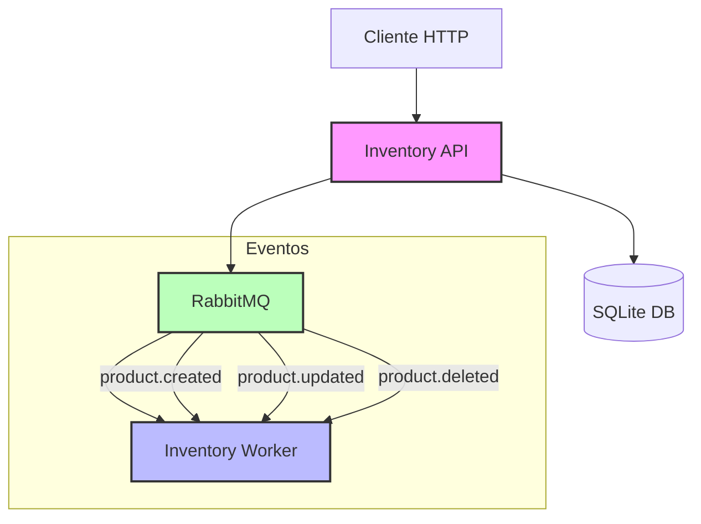

# Sistema de Inventario

Sistema distribuido para gestión de inventario que utiliza una arquitectura basada en eventos con RabbitMQ. Implementa patrones de resiliencia como Circuit Breaker y retry para manejar fallos de manera robusta.

## Arquitectura



## Características

- API REST para gestión de productos
- Procesamiento asíncrono de eventos con RabbitMQ
- Patrones de resiliencia (Circuit Breaker, Retry)
- Base de datos SQLite para persistencia
- Logging detallado de eventos y errores
- Monitoreo de mensajes en tiempo real

## Requisitos Previos

- .NET 9.0 SDK
- Docker y Docker Compose
- SQLite (incluido en el proyecto)

## Estructura del Proyecto

- `Inventory.Api`: API REST para gestión de productos
  - Controladores REST
  - Configuración de servicios
  - Publicación de eventos

- `Inventory.Worker`: Servicio de procesamiento de eventos
  - Consumo de mensajes RabbitMQ
  - Implementación de Circuit Breaker
  - Logging de eventos

- `Inventory.Domain`: Entidades y lógica de negocio
  - Modelos de dominio
  - Interfaces
  - Eventos de dominio

- `Inventory.Infrastructure`: Implementaciones de infraestructura
  - Servicios de mensajería
  - Patrones de resiliencia
  - Configuración de dependencias

## Ejecución con Docker

1. Clonar el repositorio:
```bash
git clone <url-del-repositorio>
cd Inventory.System
```

2. Iniciar los servicios:
```bash
# Para cambios en código fuente
docker compose up --build

# Para cambios en configuración Docker
docker compose down && docker compose up --build
```

Los servicios se iniciarán en el siguiente orden:
- RabbitMQ (puerto 5672)
- Inventory API (puerto 5001)
- Inventory Worker

## Ejecución Local

1. Iniciar RabbitMQ:
```bash
docker run -d --name rabbitmq -p 5672:5672 -p 15672:15672 rabbitmq:3-management
```

2. Ejecutar la API:
```bash
cd Inventory.Api
dotnet run
```

3. Ejecutar el Worker:
```bash
cd Inventory.Worker
dotnet run
```

## Configuración

Los archivos de configuración se encuentran en:
- `Inventory.Api/appsettings.json`
  - Conexión a RabbitMQ
  - Configuración de la API
  - Logging

- `Inventory.Worker/appsettings.json`
  - Conexión a RabbitMQ
  - Configuración del Worker
  - Parámetros de resiliencia

## Endpoints de la API

- `GET /api/products`: Listar productos
- `POST /api/products`: Crear producto
- `PUT /api/products/{id}`: Actualizar producto
- `DELETE /api/products/{id}`: Eliminar producto

## Monitoreo

- RabbitMQ Management UI: http://localhost:15672
  - Usuario: guest
  - Contraseña: guest
  - Monitoreo de colas y mensajes
  - Estado de conexiones

## Logs

Los logs se pueden ver con:
```bash
# Logs de la API
docker logs inventorysystem-inventory-api-1 -f

# Logs del Worker
docker logs inventorysystem-inventory-worker-1 -f

# Logs de RabbitMQ
docker logs inventorysystem-rabbitmq-1 -f
```

## Patrones de Resiliencia

- Circuit Breaker
  - Umbral de fallos: 3 intentos
  - Tiempo de reset: 30 segundos
  - Estado half-open para reintentos

- Retry
  - Máximo de reintentos: 3
  - Delay entre reintentos: 2 segundos
  - Backoff exponencial

## Troubleshooting

1. Si la API no responde:
   - Verificar logs de la API
   - Comprobar conexión a RabbitMQ
   - Revisar estado de la base de datos

2. Si el Worker no procesa mensajes:
   - Verificar logs del Worker
   - Comprobar conexión a RabbitMQ
   - Revisar estado del Circuit Breaker

3. Si RabbitMQ no está disponible:
   - Verificar logs de RabbitMQ
   - Comprobar puertos expuestos
   - Revisar configuración de red 